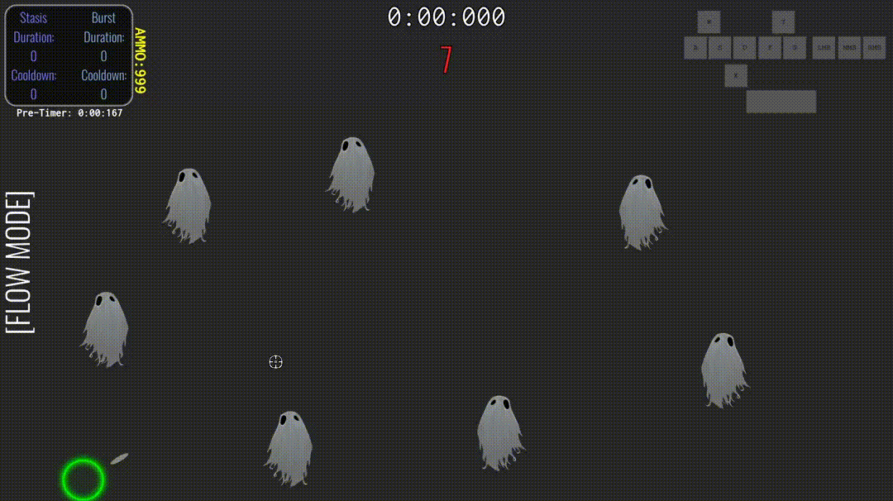

# Tempus Invictus (Just the Scripts)

I have been solo-developing this unique, 2D speedrunner/platformer/shooter with a focus on time manipulation for a long while -- unfortunately, most of my work was done before I discovered version control. As such, there is very limited history aside from my leftover alpha builds which serve mostly as a reminder of how far I've come with this project.

This repository will not allow one to run the game (however, see [Usage](#usage) for a way to run a limited version of the game in your browser). The following resources are not included:

- Audio
- Video
- Scenes
- Sprites
- All other assets

The purpose of this repository is to demonstrate the code I have written, nearly from-scratch (and starting from nearly zero-experience), for this project of mine.

## Table of Contents

- [Usage](#usage)
- [Further Steps](#further-steps)
- [Contributing](#contributing)

## Further Steps

Both completed and in-the-works developments:

- [x] Refactor code to make better use of inheritence
- [ ] Finish initial set of levels (9 easy, 9 medium, 9 hard, and 5 expert)
- [ ] Miscellaneous bug fixes that I have been documenting over time
- [ ] Improve the tutorial by conducting user tests and getting feedback

## Usage

Currently, you may play a limited version of the game in your browser at the following link:

https://anomicnonentity.itch.io/tempusinvictusdemo1

This version of the game is HTML5, which means certain features aren't available, and performance will not be as good as a desktop version. This is a work in progress, so several features will not work. If a button does not lead to a new scene, that means that the scene hasn't been finalized yet. Stick to the easy, medium, and hard levels, but note that they are not yet truly organized by difficulty. Videos in the glossary will probably not work well on this format of the game.

## Contributing

To contribute to this project, please follow these steps:

1. **Fork** the repository.
2. **Clone** your forked repository to your local machine.
3. **Create a new branch** (`git checkout -b feature/new-feature`).
4. **Make your changes** and commit them (`git commit -am 'Add new feature'`).
5. **Push** your changes to your forked repository (`git push origin feature/new-feature`).
6. **Submit a pull request** detailing your changes and any relevant information.
